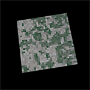
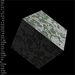

# 软件渲染器-软渲染
# 前言
&emsp;&emsp;最近我在学习计算机图形学的时候大量的上网翻书查阅资料，但是从网上和部分书籍里面看到的知识有些零散，所以我作此文章，将这些知识点串联起来。我的演示代码只是提供一个参考，希望读者通过阅读本文自己实现相应功能。本书主要是介绍 3D 渲染的流程和原理，所以有几乎没有对代码进行优化。如果要实现可用的高性能的渲染器，代码优化是必不可少的。

---
# 学习完最后一章的运行效果
| Windows             | Linux             |
|---------------------|-------------------|
|  |  |

---
# 本教程共分为三部分
- 在第一部分中，我们先学习2D图像绘制的一些相关知识，我们将会学习最基础最核心的知识：在屏幕上绘制图案。只有能在屏幕上绘制图案，我们才能在3D的世界遨游。
- 在第二部分中，我们将会进入3D的世界，体验3D图形学的奥妙。
- 在第三部分中，我们将对前面章节所做出的渲染器进行功能扩展，使其使用起来更加的方便。本部分将会模仿OpenGL的渲染管线来扩充我们渲染器的功能，实现VBO、顺时针逆时针三角形的剔除、深度复位、像素复位、双缓冲、用矩阵完成坐标变换、纹理读取、漫反射光照数学模型等功能，最终让画面动起来。

---
# 目录
- 第一部分：预备知识
    - 第1章 在屏幕上绘制图案
        1. 像素
        2. 像素的抽象表示
        3. 通过控制不同像素的亮度来组合成不同图案
        4. 单独控制每个像素的亮度
        5. Windows和Linux上的程序实现
            1. 使用EasyX实现windows下的像素绘制
            2. 使用FrameBuffer实现Linux下的像素绘制
        6. CMake的简单使用
    - 第2章 直线和三角形的绘制
        1. 线段的绘制
        2. 三角形的绘制
    - 第3章 重心坐标插值
        1. 插值
        2. 重心坐标插值
            1. 一维重心坐标插值
            2. 二维重心坐标插值
            3. 重心坐标插值的规律
            4. 重心坐标插值在栅格化程序的优化
            5. 多属性的插值
        3. 二维纹理
- 第二部分：进阶知识
    - 第4章 齐次坐标和透视投影
        1. 齐次坐标
        2. 透视投影
            1. 二维透视投影
            2. 三维透视投影
            3. 用齐次坐标表示透视投影
    - 第5章 透视校正插值
        1. 空间三角形的绘制
        2. 绘制两个三角形拼接成一个正方形
        3. 仿射变换导致的错误
        4. 透视校正插值
        5. 附录
            1. 附录一
            2. 附录二
            3. 附录三
            4. 附录四
    - 第6章 深度测试
        1. 画家算法
        2. Z-Buffer算法
    - 第7章 裁剪
        1. 一些裁剪的基本知识
        2. 深度值的另外一种表示
        3. 近平面裁剪的必要性
        4. 裁剪的实现
        5. 附录
            1. 附录一
    - 第8章 标准视锥体和设备坐标
        1. 设备坐标
        2. 设备坐标的标准化
        3. 将多边形裁剪到视锥体内部
        4. 一个核心功能完备的渲染器出炉了
- 第三部分：渲染器的功能扩展
    - 第9章 渲染器功能升级
        1. OpenGL渲染管线简介
        2. 改造我们的渲染器
        3. 三角形剔除
        4. 屏幕刷新
            1. 上一帧残留数据清理
            2. 双缓冲
    - 第10章 矩阵
        1. 透视投影矩阵
        2. 缩放矩阵
        3. 平移矩阵
        4. 旋转矩阵
        5. 坐标变换的一些技巧
        6. 完成旋转动画
    - 第11章 走进图形学的大门
        1. 漫反射光照模型
        2. 纹理生成
        3. 模型读取

---
# 文件说明
| 目录                   | 内容     |
|------------------------|----------|
| \3D 图形学知识汇编.pdf | 教学文档 |
| \code\                 | 配套代码 |
| \old\                  | 考古内容 |

---
## 补充说明
&emsp;&emsp;之前我写了一些图形学的教程，但是经过验证，发现里面有一部分数学推导是错误的(深度测试的插值算法，在齐次空间中裁剪的解释和证明)，甚至深度插值的错误会导致错误的渲染结果(并且这个错误还不太明显，所以我一直没发现自己的错误)，为此我重新修订了绝大部分的内容，这次经过我一个人(还是有点势单力薄)的努力推导，修复了上述的错误，整个教程的结构也进行的大改。但是我知识有限，可能还有很多错误存在其中，如果有读者能找到错误，还望不吝赐教。 
&emsp;&emsp;之前的代码和文章内容被我移动到了old目录，有兴趣的同学可以考古一下。