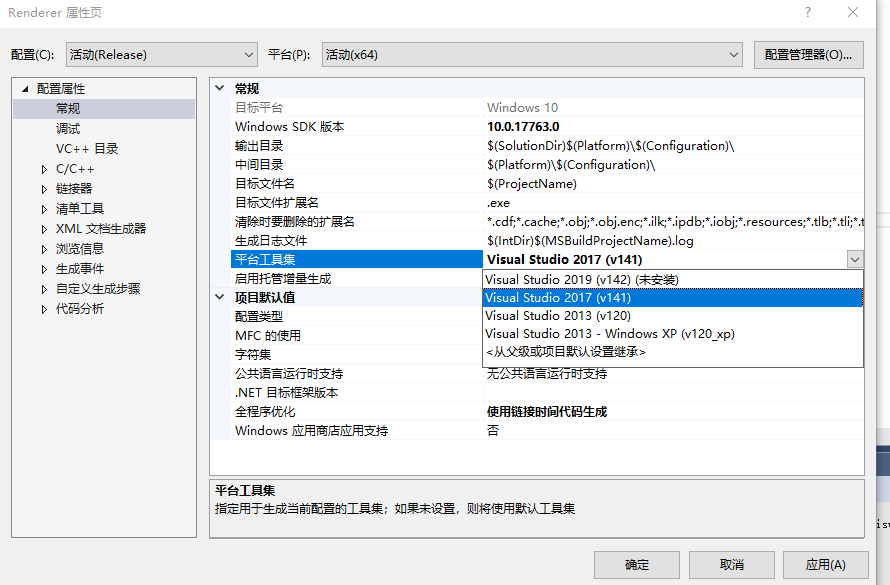

# 3D图形学入门文档已经基本完成，包含了完整的渲染流程和详细的数学推导，帮助同学们理解代码为什么这么编写，见document/PDF，和配套的代码document/code

## 纯CPU渲染

## 需要安装easyx:[进入官网](https://easyx.cn/)完成画点功能

---
如果提示如下错误：
> "error MSB8020: 无法找到 Visual Studio 2019 (v142) 的生成工具"  

请按照本方法修改项目配置:  
> 在项目上右键->属性->配置属性->常规->平台工具集中选择自己安装的VS版本即可

---
main.cpp是用户自己写的代码，其他代码类似opengl运行库

---
软件运行可以得到如下的效果:  
鼠标拖动  
  
teapot.obj  
  
woman.obj  
  

---
>主要实现的功能:
>> 一些简单的数学运算(矩阵相乘，向量叉乘等)  
>> 使用扫描线多边形填充算法绘制多边形  
>> 线性插值(linear interpolation)  
>> 透视校正插值(perspective correct interpolation)  
>> 深度测试(用于消隐)  
---
>一些我想到的但是暂时没实现的功能  
>> 不支持ddy和ddy，所以没有Mipmap，因为实现起来比较麻烦  
ddy和ddy是指在屏幕空间上求vbo的偏导数。真正的GPU绘制的时候是在屏幕同时绘制多个像素，GPU并行处理能力很强。  
比如当前GPU同时在屏幕上绘制四个点(x,y),(x+1,y),(x,y+1),(x+1,y+1)分别记为p1,p2,p3,p4，  
设前面三个点p(即不包含点(x+1,y+1))的纹理坐标分别为(u1,v1),(u2,v2),(u3,v3)，  
则点p1上的ddx(u)=(u2-u1)/1,ddy(u)=(u3-u1)/1,这个计算值可以用来计算Mipmap，  
同时现在主流游戏引擎上面的法线贴图都是用MikktSpace计算切线空间，也需要求偏导数，但是对我们现在的这个渲染器来说，这些可以暂时不考虑  
---
> 209.7.23更新：
>> 在片元着色器添加了漫反射光照模型
>
> 2019.7.23更新:
>> demo中新增obj文件读取函数
>
> 2019.7.22 23:12更新:
>> 优化多边形扫描线填充，当多边形某些顶点超出屏幕时，只绘制屏幕中的扫描线，忽略掉超出屏幕的扫描线
>
> 2019.7.22更新:
>> 新增bmp纹理支持，支持24位，无压缩bmp图片，纹理读取速度大幅度提升
